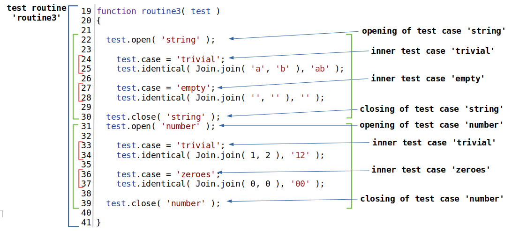

## Test case

Test case or group of test checks is one or more test checks with an accompanying code combined into a logical unit to test the functionality of an aspect of a test object. 

### Definition using `test.case` field

Apply the `test.case` field to determine the test case.

The test routine `routine1` has test cases called `trivial` and `empty`. The determination of the test case is done by assigning a string value to the `case` field. The beginning of the next test case closes the previous one. Therefore, the test case `empty` that opens in row 27 closes the test case` trivial`.

### Definition using `test.open()` and `test.close()` fields

To group the test checks use the `test.open ()` and `test.close ()` routines.

The test routine `routine2` has the same structure as with the` routine1` test routine. It has a test cases called `trivial` and `empty`. In order to set the test case, the `test.open()` routine is used, and the test case name is passed as an argument to the routine. The `test.close()` routine closes the test case. `test.close()` routine as `test. open()` routine takes the name of the test case as an argument.

The test routine `routine3` has two test groups called `string` and `number`. They are grouped according to the type of arguments passed to the `Join.join` routine being tested. The `string` group is described in strings 22-30, the` number` group is described in strings 31-39. The `string` group contains 2 test cases:` trivial` and `empty`, each of which has one check. The `number` group has a test case` trivial` and `zeroes` with one check in each. A report based on such a test routine structure can be seen in the tutorial about [how to read a report](Report.md).

The structure of the routine test can be complex and have many levels of nesting<!-- en : nesting -->.

[Back to content](../README.md#Concepts)