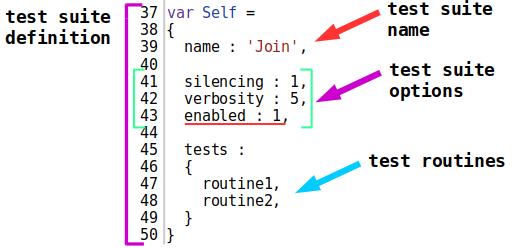

# Опція запуска

Параметр для керування процесом тестування, який передається через команду запуску. Опції тестування застосовується до кожного тест сюіта.

Опція запуску вказується після введення команди утиліти. Наприклад, в команді

```
tst path/to/dir accuracy:1e-4
```

указана опція `accuracy`, котра встановлює допустиме числове відхилення. Указана опція буде застосована до кожного тест сюіту в директорії `path/to/dir`.


Опції запуску переписують <!-- eng:override --> опції тест сюіта. Якщо одна і та ж опція задана і через команду і в коді теста то вищий пріорітет має команда.

Одночасно можна застосовувати декілька опцій запуска в команді. Наприклад, команда з опціями `verbosity` i `silencing` може виглядати так:

```
tst path/to/dir verbosity:6 silencing:1
```

Ви можете більш детально ознайомитись з переліком опцій запуску перейшовши до [туторіалу](../tutorial/Help.md#Опції-запуску-та-опції-сюіта).

# Опція тест сюіта

Параметр для керування процесом тестування, який вказується в коді визначення тест сюіта. Такі опції переписують значення за замовучуванням і, в свою чергу, можуть бути переписані опціями запуску.

Формулювання опцій запуску і опцій тест сюіта однакові. Опції тест сюіта мають нижчий пріоритет ніж опції запуску. Тому, якщо тест сюіт і команда запуску мають однакову опцію, то утиліта використовує опцію запуску й ігнорує опції тест сюіта.



На рисунку показана частина коду з визначенням тест сюіта. Після указання імені в тест сюіті позначаються опції тестування.

Тест сюіт має три опції: `silencing`, `verbosity` i `enabled`. При виконанні команди тестування без указаних опцій рівень вербальності звіту буде `5` і звіт не міститиме вивід об'єкту тестування. При застосуванні команд з опціями `silencing` i `verbosity` утиліта використає значення, що указане в команді. Наприклад, при використанні команди

```
tst path/to/dir verbosity:3
```

утиліта виведе звіт з рівнем вербальності `3`.

Деякі опції, як наприклад опція `enabled` (підкреслена червоним) присутня тільки в тест сюіті, вона призначена для вимкнення тест сюіту з тестування. Опція приймає значення `0` і `1`. При `0` - тестування не виконується, `1` - виконується. За замовчуванням встановлено `1`.

# Опція тест рутини

Параметр для керування процесом тестування заданий в окремій тест рутині.

Опції тест рутин використовуються для більш точного налаштування процесу тестування.

Якщо тест рутина не має явно вказаних тест опцій, то тоді вона використовує опції встановлені за замовчуванням. Опції за замовчуванням можуть бути переписані опціями тест сюіта або опціями запуску.

Опції тест рутини, що вказані явно, мають вищий пріоритет ніж опції тест сюіта і опції запуску. Якщо опції тест рутини вказані явно, то їх можна змінити лише відкорегувавши файл тест сюіта.


На приведеному рисунку показана рутина `routine1`. Після визначення тест рутини в рядках 6-32, в рядках 33-34 указуються опції тест рутини: `timeOut` i `accuracy`. Опція тест рутини вказується через присвоєння значень полям тестової рутини `routine1`.

В указаній рутині опція `timeOut` має значення 60000мс, тобто, розробник виділяє на її проходження одну хвилину часу.

Час відведений на рутину може бути змінений для всіх рутин і опцією запуску `routineTimeOut` або аналогічною опцією тест сюіта. Але в такому випадку значення зміниться для всіх тест рутин, для яких не вказано `timeOut`. Для індивідуального налаштування рутини встановлюйте опції рутини.

Можливе застосування команди з опцією `accuracy` або `routineTimeOut` не вплине на роботу тестової рутини `routine1` так, як опції рутини мають вищий пріорітет.

[Повернутись до змісту](../README.md#Концепції)
